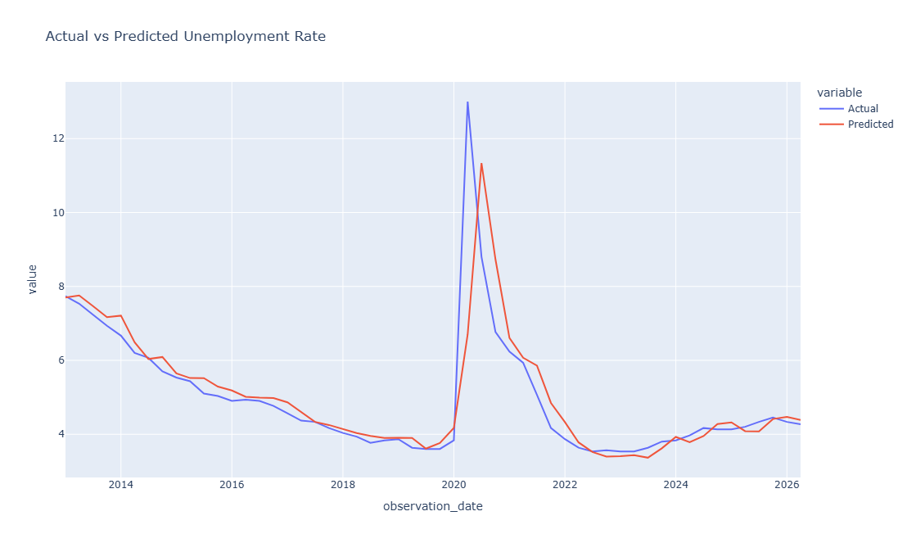

# Unemployment Rate Prediction Using Machine Learning


<p align="center">
  
</p>


## About the Project

This project was created as a practice project while learning machine learning and applying it to economic data.

The goal was to predict the unemployment rate using macroeconomic indicators and understand how different features affect model performance.





The project covers the main steps of a machine learning workflow:

* Data collection
* Data preprocessing
* Exploratory data analysis
* Feature engineering
* Model training and evaluation

---

## Dataset

The data was collected from the Federal Reserve Economic Data (FRED) database.

Features used:

* GDP
* CPI
* M2 Money Supply
* Interest Rate

Target variable:

* Unemployment Rate

The datasets were converted into quarterly frequency and combined into one dataset with 270 observations.

---

## Feature Engineering

To improve the model, I created additional features:

* GDP Growth
* CPI Growth
* M2 Growth
* Previous quarter unemployment rate (Lag Feature)

The lag feature was added because unemployment usually changes gradually over time.

---

## Model

I used **Linear Regression** and tested different approaches.

### Model 1: Original Variables

Features:

* GDP
* CPI
* M2
* Interest Rate

Result:

```
R² Score: -0.026
```

---

### Model 2: Growth Features

Features:

* GDP Growth
* CPI Growth
* M2 Growth
* Interest Rate

Result:

```
R² Score: 0.02
```

---

### Model 3: Growth Features + Lag Feature

Features:

* GDP Growth
* CPI Growth
* M2 Growth
* Interest Rate
* Previous unemployment rate

Result:

```
MAE: 0.39
RMSE: 0.99
R² Score: 0.65
```

Adding the lag feature significantly improved the model performance.

---

## Key Findings

* Previous unemployment rate was the most useful feature for prediction.
* Economic variables often affect unemployment with delays.
* Feature engineering had a major impact on model performance.

---

## Libraries Used

* Python
* Pandas
* NumPy
* Scikit-learn
* Matplotlib
* Seaborn
* Pandas DataReader

---

## Future Improvements

* Try other machine learning models such as Random Forest and XGBoost.
* Add more economic indicators.
* Explore time-series forecasting models such as ARIMA.
